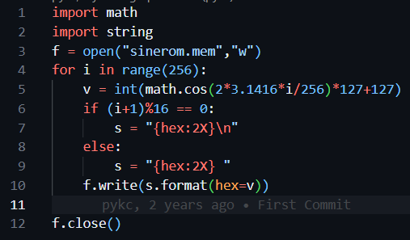
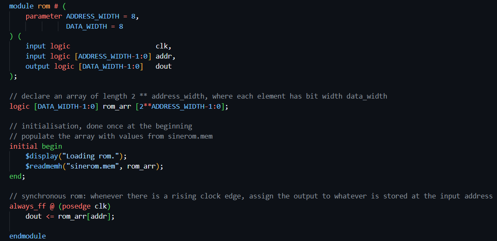
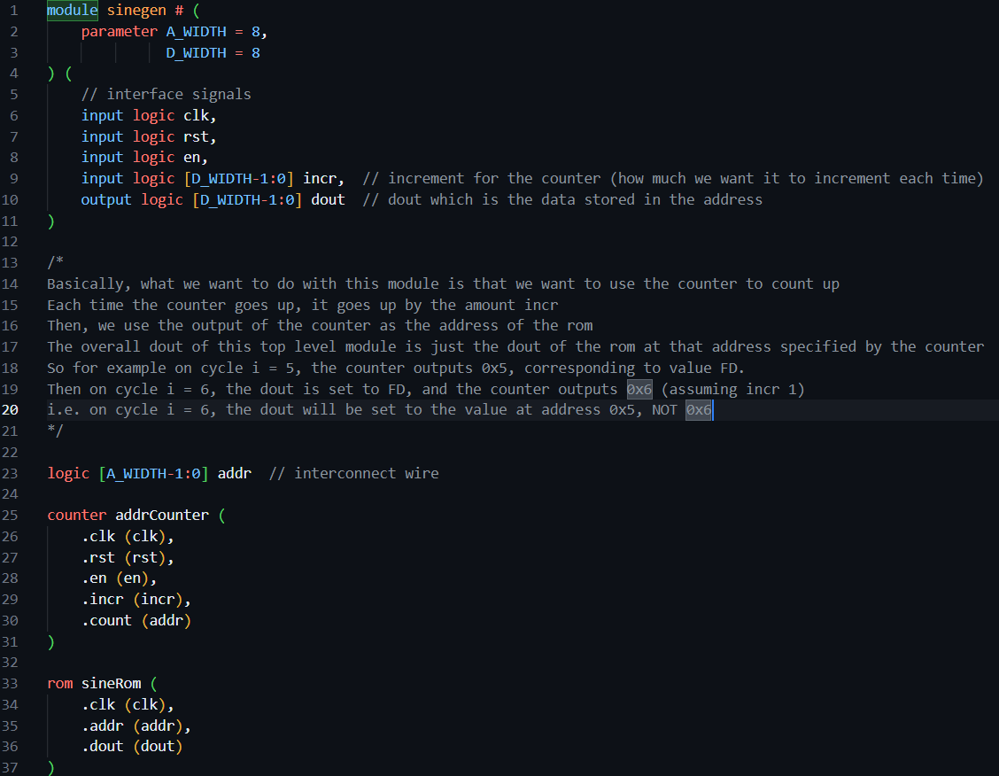
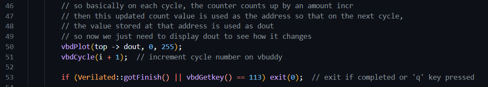
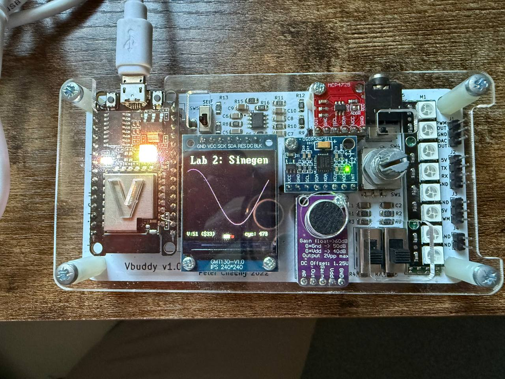
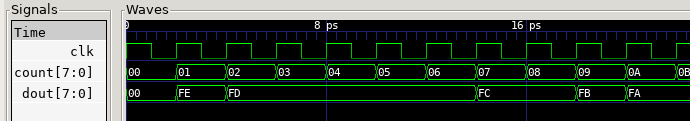
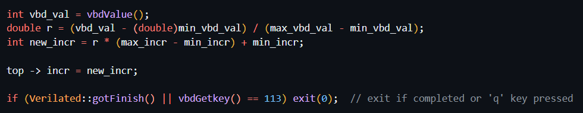

# Task 1

First we look at the file sinegen.py. 

Basically, this code simply divides an interval of 2pi into 256 equally-spaced samples, and computes the cosine value for each of them. So the first point is 0 / 256 * 2pi, then 1 / 256 * 2pi, 2 / 256 * 2pi, 3 / 256 * 2pi ... and so on until the last point 255 / 256 * 2pi. Then, since the cosine value is [-1, 1], this range is scaled to the range [0, 254] by multiplying by 127 then adding 127. The 256 values are then written into the file sinerom.mem. Formatting is done such that we have 16 rows of 16 numbers each.

Then, inside the rom.sv file, we initialise the rom by reading the 256 values from the sinerom.mem, and storing them inside the array.

Next, we want to create a top level module sinegen.sv which implements the circuit below:

This is implemented in sv as follows. See comments on details

The next thing is to implement the C++ testbench to interface vbuddy with the module. This is very straightforward. The counter just updates the interconnect wire internally every cycle, thus updating the dout. Hence we simply need to plot top -> dout on the vbuddy using vbdPlot.

This gives the following output on the vbuddy:

We can also see the one cycle delay using GTKWave. For example, address 0 stores FE, and address 1 stores FD. Initially, the counter is at 0. Hence on the next cycle, the value stored at address 0, i.e. FE, is output as dout, and the counter becomes 1. So basically e.g. when the counter is at address 1, the value of dout is not the value at address 1, but rather the value at address 0.

Next step is we want to use the rotary encoder (i.e. the vbdValue) to change the frequency of the sine wave. To change the frequency of the sine wave, we simply need to edit the value of top -> incr. For example, suppose top -> incr is increased from 1 to 2. This means that we are skipping every other address in the rom. In other words, we are sampling every other point in the sine wave, and hence the frequency is doubled.

However, we have to limit how high up incr can get. Because suppose for example incr is 256, this means that we just end up sampling the same point over and over again and we just see a straight line. By observation, it appears that for incr values > 20, the sampled points are such that it is hard to observe the shape of the sine wave when plotted on vbuddy. Hence, a limited range of [1, 20] for incr is set. Hence, on every cycle, we simply read the value of vbdValue, and scale it to [0, 20], and assign it to top -> incr, thus allowing us to change the frequency by rotating the rotary encoder.

We implement this in the following testbench. Note that we have defined const int max_vbd_val = 255, min_vbd_val = 0, min_incr = 1 and max_incr = 20. We then perform the scaling as follows:

This gives the following output when plotted on vbuddy. We can see the frequency changing when rotating the rotary encoder.

