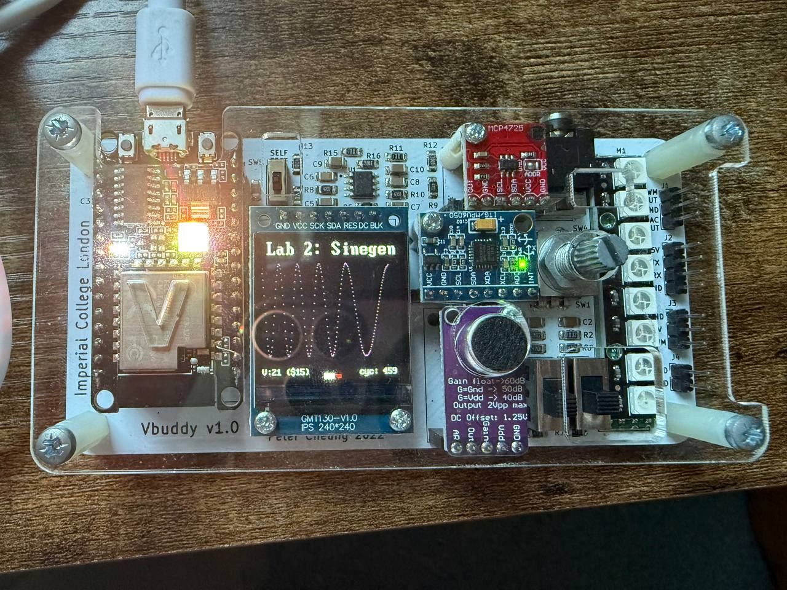
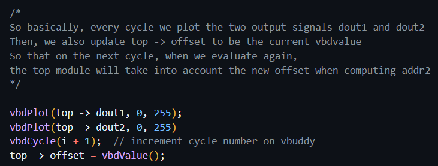
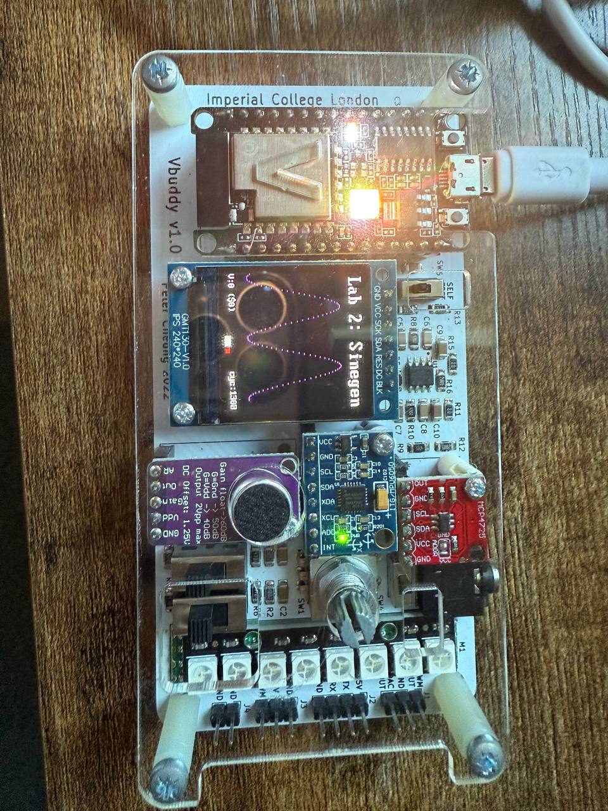

# Task 1

First we look at the file sinegen.py. 

Basically, this code simply divides an interval of 2pi into 256 equally-spaced samples, and computes the cosine value for each of them. So the first point is 0 / 256 * 2pi, then 1 / 256 * 2pi, 2 / 256 * 2pi, 3 / 256 * 2pi ... and so on until the last point 255 / 256 * 2pi. Then, since the cosine value is [-1, 1], this range is scaled to the range [0, 254] by multiplying by 127 then adding 127. The 256 values are then written into the file sinerom.mem. Formatting is done such that we have 16 rows of 16 numbers each.

Then, inside the rom.sv file, we initialise the rom by reading the 256 values from the sinerom.mem, and storing them inside the array.

Next, we want to create a top level module sinegen.sv which implements the circuit below:

This is implemented in sv as follows. See comments on details

The next thing is to implement the C++ testbench to interface vbuddy with the module. This is very straightforward. The counter just updates the interconnect wire internally every cycle, thus updating the dout. Hence we simply need to plot top -> dout on the vbuddy using vbdPlot.

This gives the following output on the vbuddy:

We can also see the one cycle delay using GTKWave. For example, address 0 stores FE, and address 1 stores FD. Initially, the counter is at 0. Hence on the next cycle, the value stored at address 0, i.e. FE, is output as dout, and the counter becomes 1. So basically e.g. when the counter is at address 1, the value of dout is not the value at address 1, but rather the value at address 0.

Next step is we want to use the rotary encoder (i.e. the vbdValue) to change the frequency of the sine wave. To change the frequency of the sine wave, we simply need to edit the value of top -> incr. For example, suppose top -> incr is increased from 1 to 2. This means that we are skipping every other address in the rom. In other words, we are sampling every other point in the sine wave, and hence the frequency is doubled.

However, we have to limit how high up incr can get. Because suppose for example incr is 256, this means that we just end up sampling the same point over and over again and we just see a straight line. By observation, it appears that for incr values > 20, the sampled points are such that it is hard to observe the shape of the sine wave when plotted on vbuddy. Hence, a limited range of [1, 20] for incr is set. Hence, on every cycle, we simply read the value of vbdValue, and scale it to [0, 20], and assign it to top -> incr, thus allowing us to change the frequency by rotating the rotary encoder.

We implement this in the following testbench. Note that we have defined const int max_vbd_val = 255, min_vbd_val = 0, min_incr = 1 and max_incr = 20. We then perform the scaling as follows:

This gives the following output when plotted on vbuddy. We can see the frequency changing when rotating the rotary encoder.

# Task 2

Now we want to generate two sine waves simultaneously which have different phases. We want to be able to change the phase offset in real time by turning the rotary encoder. We do this by replacing the ROM in task 1 with a 2-read port ROM. The first port address is taken from the counter, as usual. However, the second port address, is the first port address + some offset.

We update the top level .sv specification by adding another output dout2, and adding another input offset. So that the module takes in offset as an external signal, and internally, when it updates the count (which is used as addr1), it adds the offset to the count and uses it as addr2.

Then, we interface this module with the vbuddy simply by updating the value of top -> offset to the current vbdValue() every cycle, so that every cycle the top level module can compute the new address internally with the new offset.

This gives us the following output on vbuddy. When the offset is 0, both waves are in phase. As we rotate the rotary encoder and edit the offset value, the phase difference of the two waves changes.

# Task 3

The next task is to use the vbuddy's microphone to capture an audio signal. We define a buffer of size 512, and basically how this works is that the microphone will capture 512 samples of 8 bits which corresponds to the audio signal, and store this in the buffer. And every cycle, when we call vbdMicValue(), it will just read the next sample in the buffer. Once we have read everything in the buffer, the microphone will automatically capture another 512 block of audio samples and store it in the buffer and the process repeats.

So basically, every cycle, we call vbdMicValue() to get the next audio sample in the buffer and write it into the RAM. Then on the next cycle, we read the next value in the buffer and write it into the next address of the RAM, and so on. So we just keep on capturing the audio level on every cycle and write it into successive locations in the RAM.

At the same time, while we write into one address in the RAM, we also want to read the audio signal at a certain offset, where the offset can be varied in real time by turning the rotary encoder which changes the vbdValue. By reading at an offset, the retrieved signal is basically just a delayed version of the audio signal.

Example: suppose the vbdValue is initially set to 64. Then how it works is that, initially the counter, which is used as addr1 in the RAM, is set to 0. So we read from address 0, and we write to the address (counter + offset), which is 64. Then, on the next cycle, we read from 1 and write to 65, then read from 2 and write to 66, and so on. So initially for the first 64 cycles we are just reading 0s, and once we reach address 64 (i.e. we read from 64 and write to 128), then we start reading the audio signal which was written earlier. Hence, we are just reading a delayed version of the audio signal.

To do this, we first need to create a 512x8 dual-port RAM so that we can read and write to memory at the same time. This is implemented as follows:

Next, we combine the RAM together with the counter to create the top level module, sigdelay.sv, implemented as follows:

So how this works is that, on every cycle, we have the counter's output, which is passed to ram as the read address, and then we add the read address together with the input offset to form the write address. So on each cycle, during rising edge of clk, the ram will write the current audio data into the write address, and at the same time read the stored audio data from the read address and output it as dout. In the same cycle, the counter will update its value, so that on the next cycle, the process repeats and the new counter's output is taken as the new read address and so on.

The final step is to interface the top level module together with vbuddy. This is done by first initialising the size of the audio buffer using the code `vbdInitMicIn(RAM_SZ)` where RAM_SZ is 512. This line informs vbuddy the size of the audio buffer to reserve to store the captured sample. RAM_SZ is simply 512, since the ram we are using has size 512. So we just maintain a buffer of 512x8 audio signal, so that everytime we call vbdMicValue(), we get back the next 8-bit value in that buffer.

The rest of the code to interface vbuddy with the DUT is shown as follows. See comments for details

This gives the following output:

First, there is no audio source, and both the current and delayed signal are both 0.

Next, when we put in the audio source (using online tone generator), we see the current signal showing the sinusoidal audio signal. However, because we are writing ahead (e.g. reading from address 100 and writing to 164), the delayed signal does not appear yet.

After sometime, the counter has incremented sufficiently such that the read address has now caught up, i.e. we are now reading from an address which we wrote to previously, hence we now see both the current and delayed signal displaying the audio.

Finally, we can also rotate the rotary encoder to adjust the offset, so in this case decreasing the offset and thus making the delay smaller.